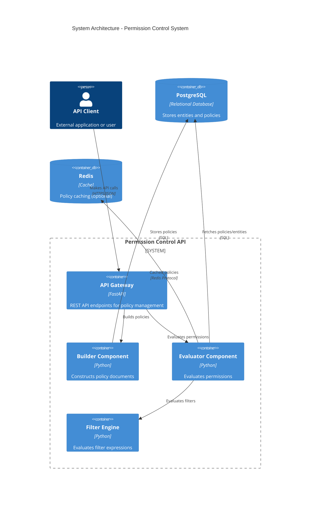
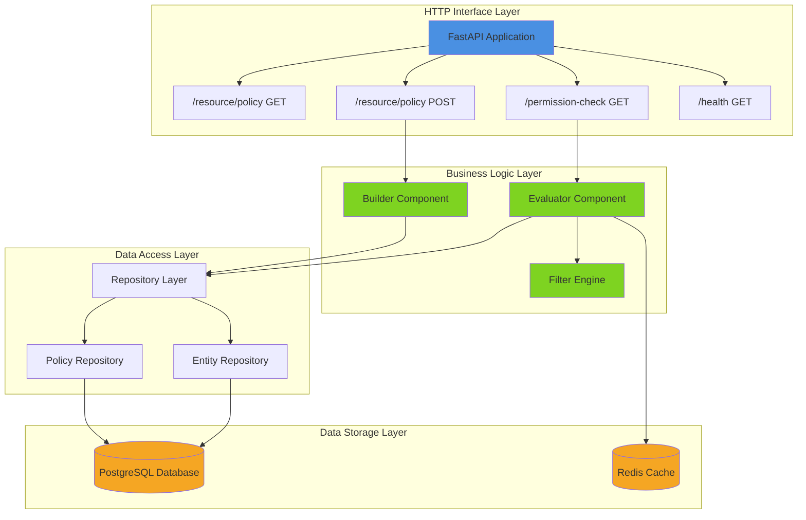
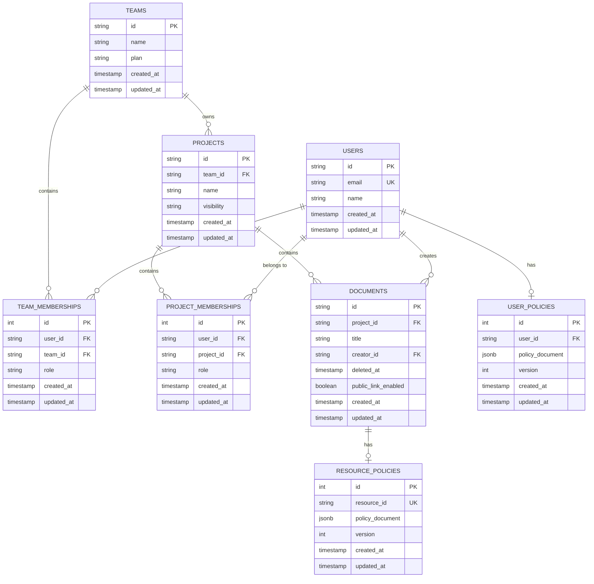
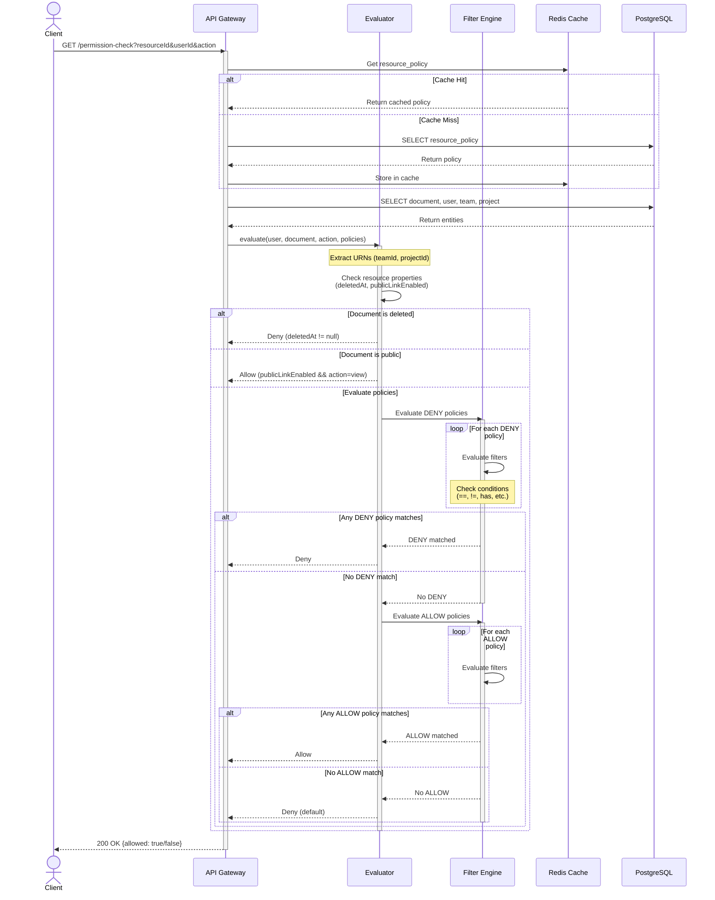
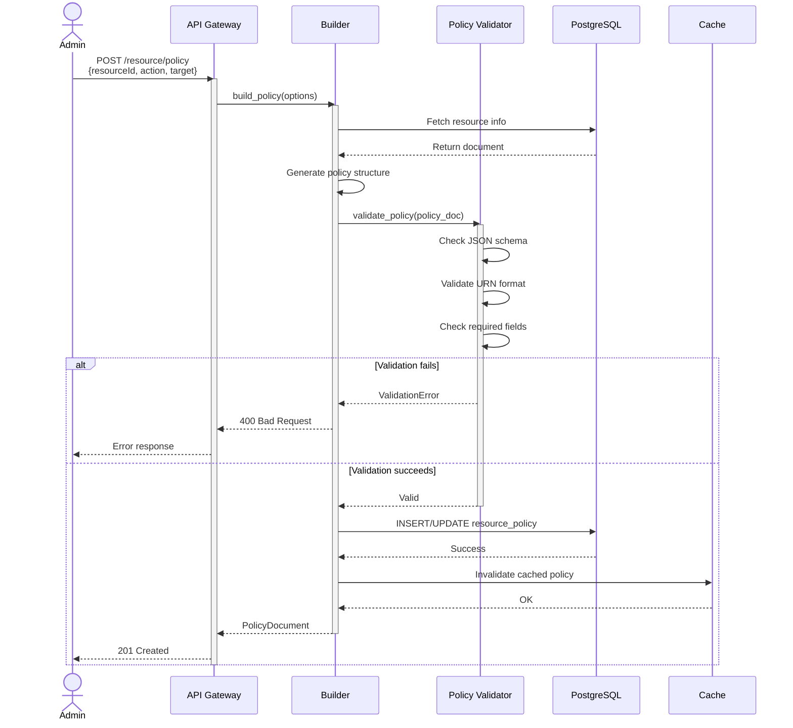
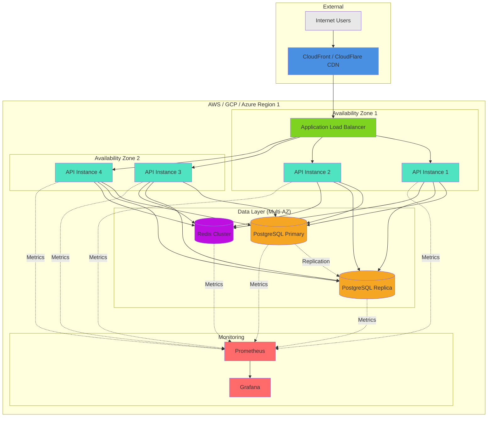
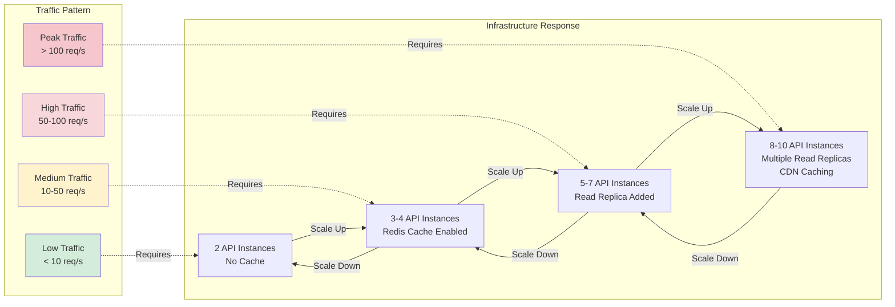

# Architecture Diagrams

## 1. System Architecture Overview (C4 Container Diagram)



## 2. Service Component Diagram



## 3. Database Schema (ER Diagram)



## 4. Permission Evaluation Flow



## 5. Policy Document Creation Flow



## 6. Deployment Architecture (Production)



## 7. Filter Evaluation Engine Logic

```mermaid
flowchart TD
    Start([Start Filter Evaluation]) --> GetFilter[Get Filter Object<br/>{prop, op, value}]
    GetFilter --> ExtractProp[Extract Property Value<br/>from Context]

    ExtractProp --> PropExists{Property<br/>Exists?}
    PropExists -->|No| ReturnNull[Return null<br/>Insufficient Data]
    PropExists -->|Yes| CheckOp{Check<br/>Operator}

    CheckOp -->|"=="| EQ[Compare Equality]
    CheckOp -->|"!="| NE[Compare Not Equal]
    CheckOp -->|">"| GT[Compare Greater Than]
    CheckOp -->|">="| GTE[Compare Greater or Equal]
    CheckOp -->|"<"| LT[Compare Less Than]
    CheckOp -->|"<="| LTE[Compare Less or Equal]
    CheckOp -->|"<>"| NENull[Check Not Null]
    CheckOp -->|"in"| IN[Check In List]
    CheckOp -->|"not in"| NIN[Check Not In List]
    CheckOp -->|"has"| HAS[Check Contains<br/>URN Substring]
    CheckOp -->|"has not"| HASNOT[Check Not Contains]

    EQ --> ReturnBool[Return Boolean]
    NE --> ReturnBool
    GT --> ReturnBool
    GTE --> ReturnBool
    LT --> ReturnBool
    LTE --> ReturnBool
    NENull --> ReturnBool
    IN --> ReturnBool
    NIN --> ReturnBool
    HAS --> ReturnBool
    HASNOT --> ReturnBool

    ReturnBool --> End([End])
    ReturnNull --> End

    style Start fill:#4A90E2
    style End fill:#4A90E2
    style ReturnBool fill:#7ED321
    style ReturnNull fill:#F5A623
    style CheckOp fill:#BD10E0
```

## 8. Scaling Strategy


