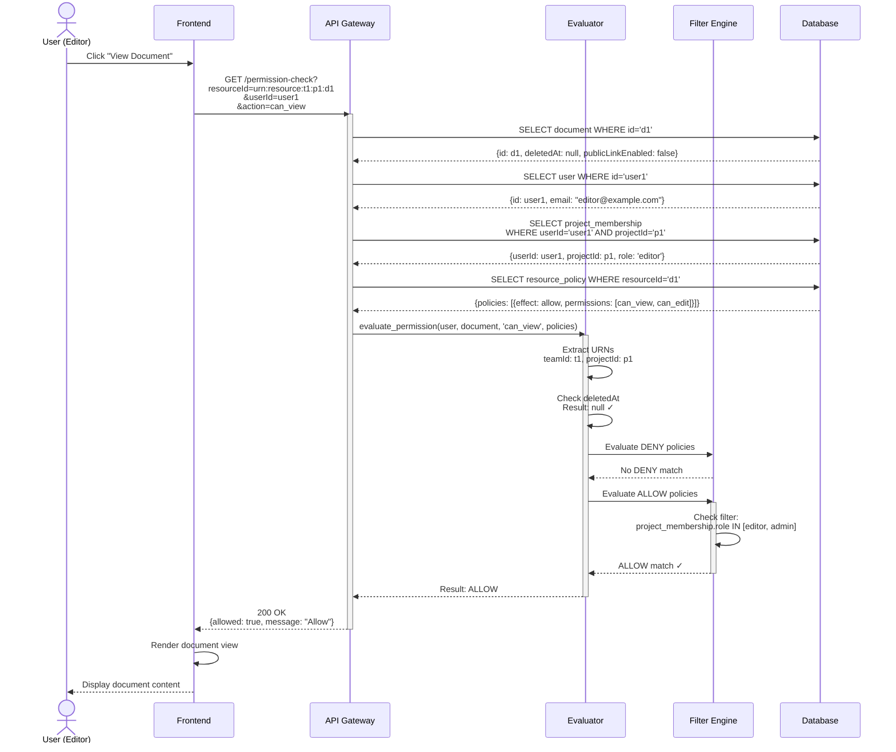
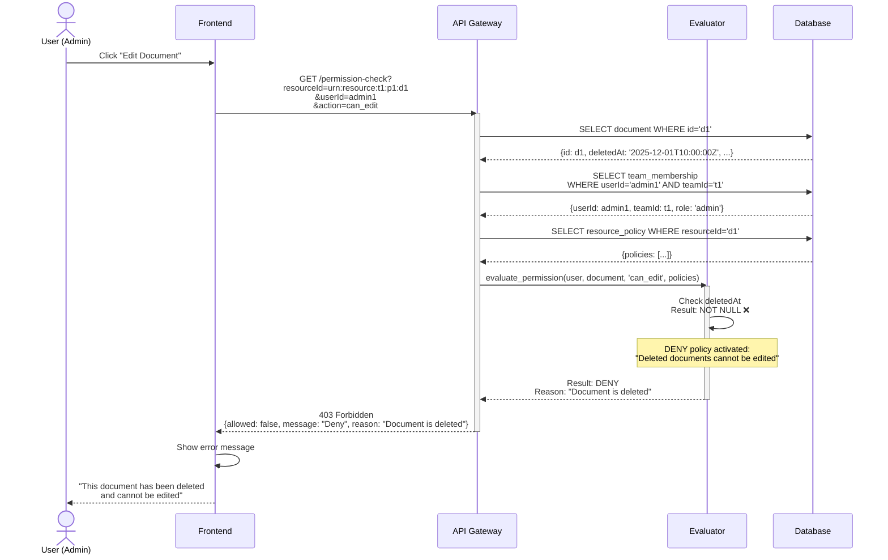
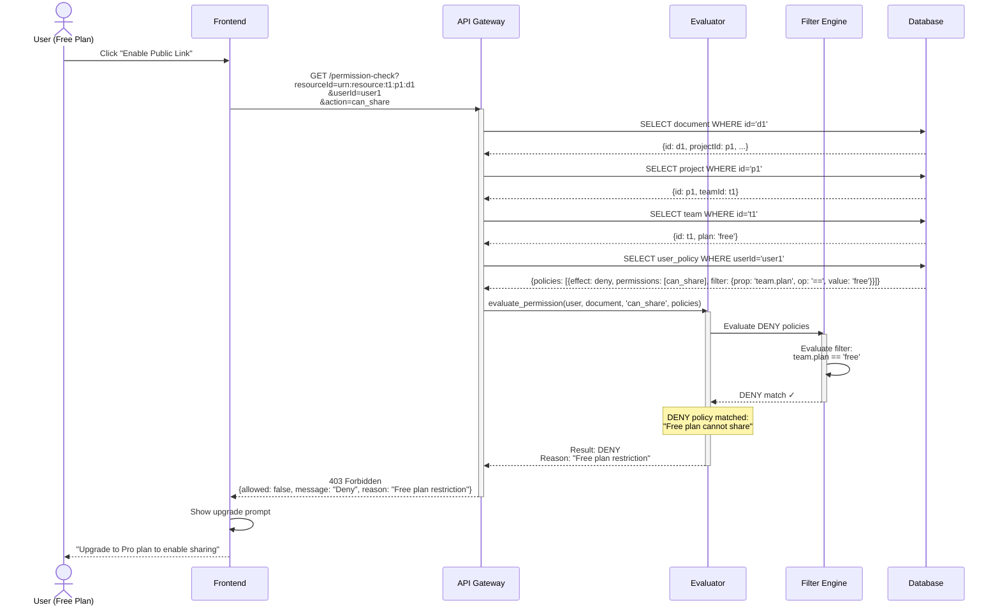
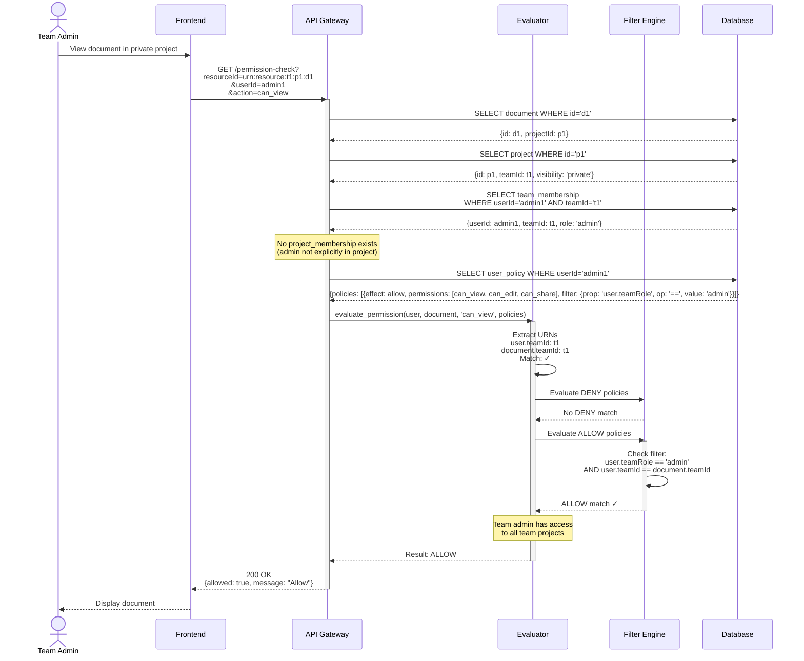
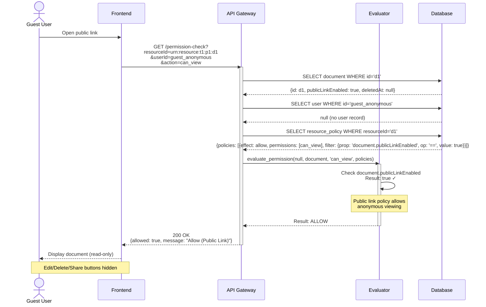
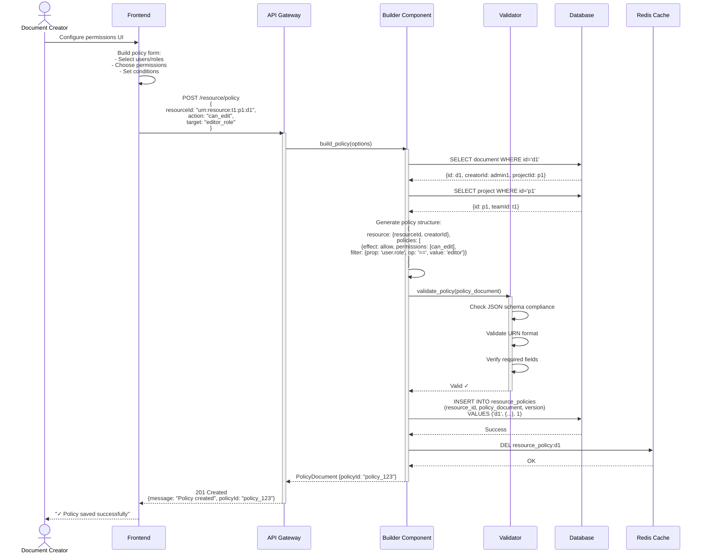
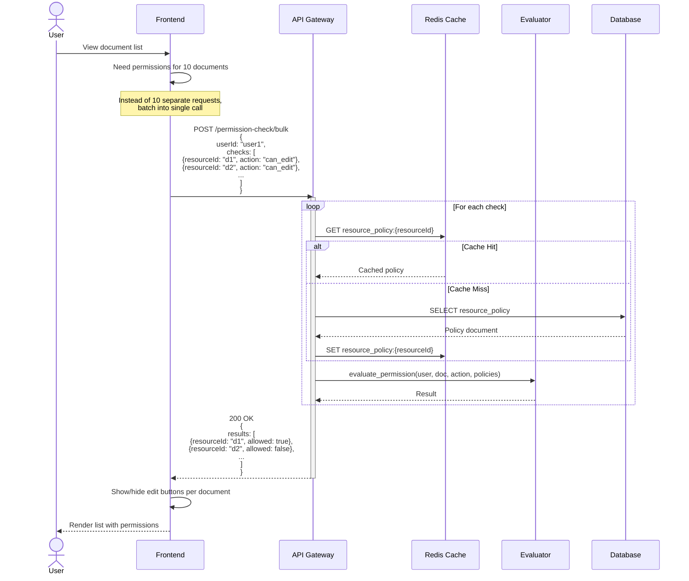
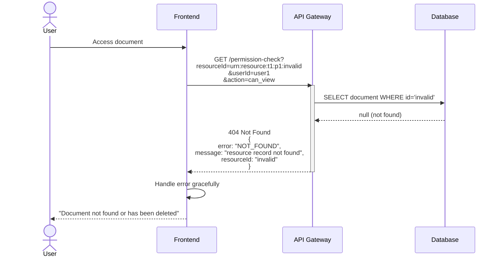
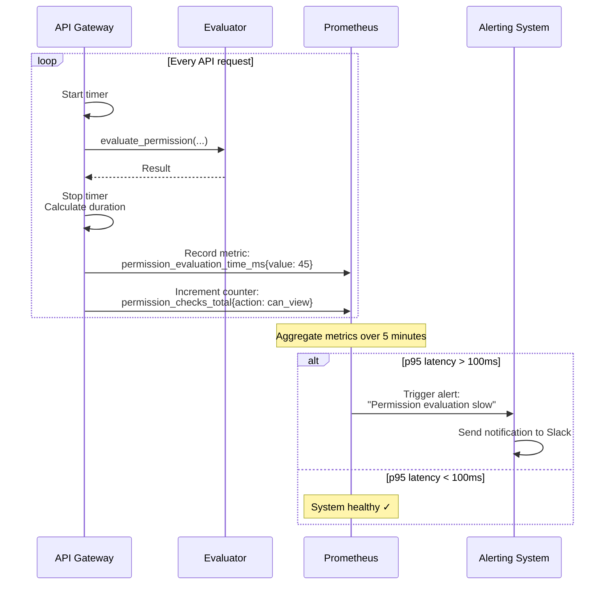

# Service Sequence Diagrams - Permission Control Service

## Overview
This document contains detailed sequence diagrams for all major user scenarios in the Permission Control System, showing the complete interaction flow between components.

---

## Scenario 1: Regular User Views Document

**Use Case**: A project editor wants to view a document they have access to

---

## Scenario 2: User Attempts to Edit Deleted Document

**Use Case**: Team admin tries to edit a document that has been soft-deleted

---

## Scenario 3: Free Plan User Attempts to Change Share Settings

**Use Case**: User on free plan tries to enable public link sharing (blocked by policy)

---

## Scenario 4: Team Admin Accesses Private Project Document

**Use Case**: Team admin can access documents in any project within their team

---

## Scenario 5: Guest User Accesses Public Link Document

**Use Case**: Unauthenticated or external user views document with publicLinkEnabled=true

---

## Scenario 6: Create New Policy Document

**Use Case**: Admin creates a new resource policy for a document

---

## Scenario 7: Bulk Permission Check (Optimization)

**Use Case**: Frontend checks permissions for multiple documents at once (list view)

---

## Scenario 8: Error Handling - Missing Resource

**Use Case**: Permission check for non-existent document

---

## Scenario 9: Performance Monitoring

**Use Case**: System tracks and alerts on slow permission evaluations

---

## Summary

These sequence diagrams cover:

1. ✅ **Happy path** - Regular permission checks
2. ✅ **DENY policies** - Deleted documents, free plan restrictions
3. ✅ **ALLOW policies** - Team admin access, public links
4. ✅ **Policy management** - Creating policies
5. ✅ **Performance optimizations** - Caching, bulk checks
6. ✅ **Error handling** - Missing resources
7. ✅ **Observability** - Monitoring and alerting

All scenarios follow the architecture defined in `3_ARCHITECTURE.yaml` with proper separation of concerns and clear component boundaries.
